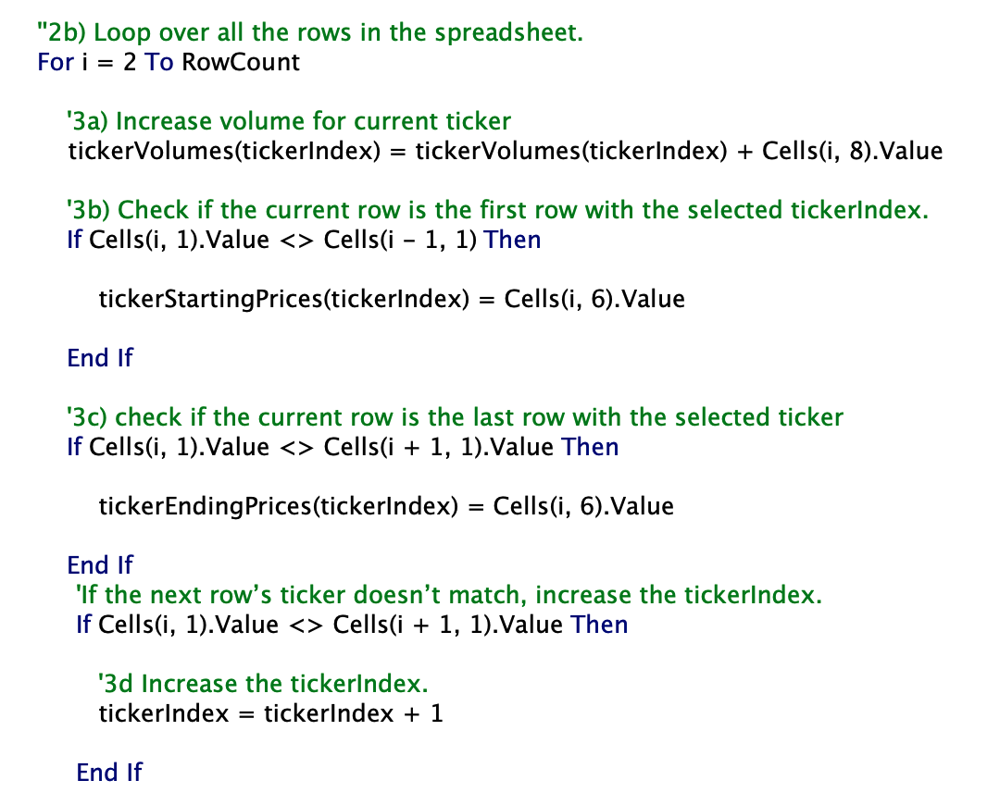
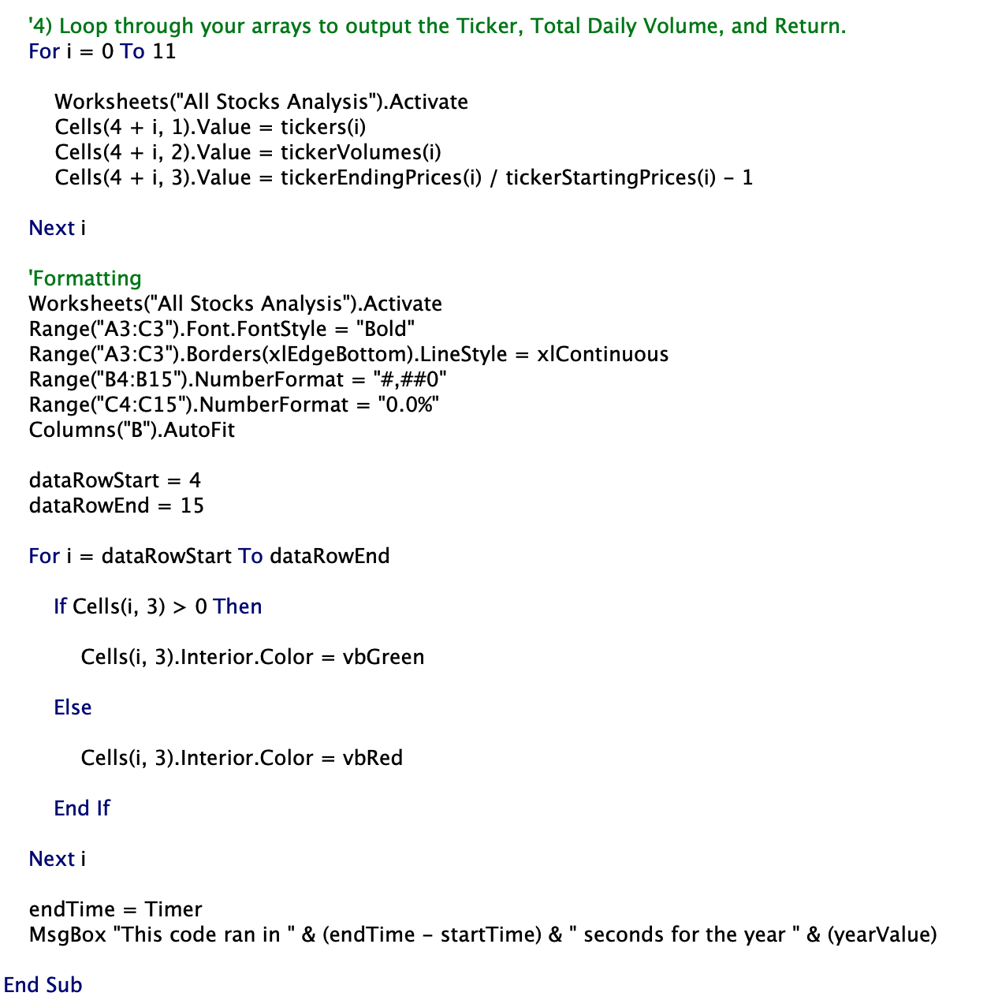
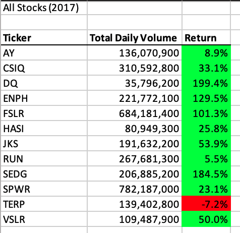
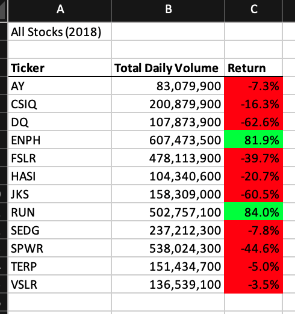
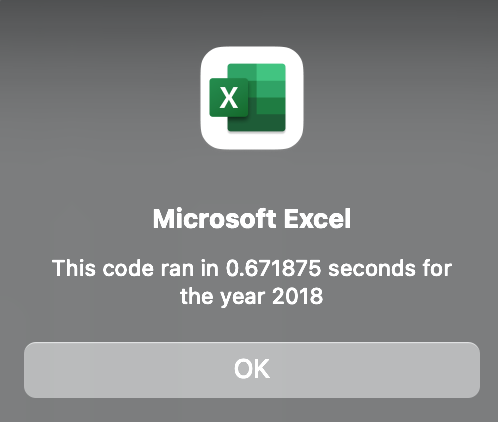
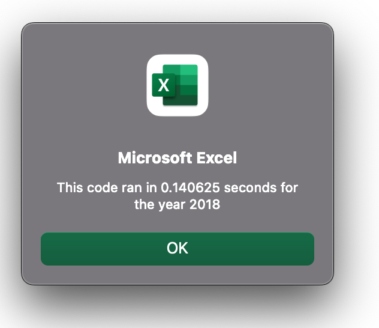

# stock-analysis

## Overview/Purpose of Project:
   * The purpose of this project was to help Steve analyze the stock market for his parents by providing/refactoring a VBA code/script that is clean, efficient and minimizes the time to run it in an excel workbook. Moreover, the code would enable his parents to analyze stocks from other years making the code even more useful. Below is a brief snapshot/summary of our results as we compare the stock performance between 2017 and 2018, and demonstrate the decrease in execution times of the refactored script when compared to the original script.

## Results:
   * **Our code:** After refactoring the code, it became obvious that the "**For Loop**" was the critical element that would enable us and Steve's parents to analyze the stock data with minimal effort. Moreover, The For Loops we implemented allowed us to quickly examine stock data associated with an array (list) of 12 total tickers and effortlessly calculate total daily volume and return for each ticker and most importantly apply it to different years of data. Below are examples of two critical For Loops we used to make this possible. 
     * **Looping Over Rows:** In the below example, we created a For Loop that combs through the spreadsheet by looping over all the rows and with the help of conditionals, we were able to determine and store the starting and ending prices for the desired year. See below.
       * 
     * **Looping through arrays to output Ticker, Total Daily Volume, and Return:** The next critical For Loop we created enables us to ouput the desired result (Total Daily Volume and Return). Following this step, we were able to create a code to that would apply formatting for the worksheet "All Stocks Analysis." Notice towards the end of the code there is an "endTime = Timer" followed by a Msg Box dictating the code run time with the year value. We will get in more detail on this later. For now, reference the below image.
       * 
   * **Comparing 2017 and 2018 Stock Performances:** After our coding/refactoring was complete, we were able to run our full VBA script and compare 2017 and 2018 stock performances thanks to quick calculations and conditional formatting. As seen in the images below, RUN and ENPH are the only stocks that had positive returns in both 2017 and 2018. Based on this, Steve's parents should feel more secure in investing in these stocks compared to others. See images below.
       * **2017 Returns:** 
         * 
         
       * **2018 Returns:** 
         * 
         
   * **Comparison of Execution Times:** Not only were we able to retrieve the results we needed, the refactoring of the code made our script run quicker and more efficient. See below images for a comparison of the run times for 2018 data using the original script and the refactored script.
   
       * **Run Time using Original Code (2018):**  
         * 
         
       * **Run Time using REFACTORED Code (2018):**
         * 
    
## Summary: 
   * Overall, refactoring the code/script was a success. However, there are advantages and disadvantages to refactoring code. One advantage as demonstrated above is the reduction of execution time. Additionally, refactoring code, if done correctly, makes the script cleaner and easier to read (aka more efficient). The big disadvantage of refactoring code is it can be difficult to read or follow the original script, especially if someone else coded it and failed to add comments. This makes refactoring more time consuming.  Fortunately, in our case, we had comments included in the script that allowed us to understand the logic and purpose behind what we were doing. Admittedly,  it was easy to get tunnel vision at times and get stuck in pieces of code; however, the comments in the script helped us regain focus and accomplish our goal.  
      
